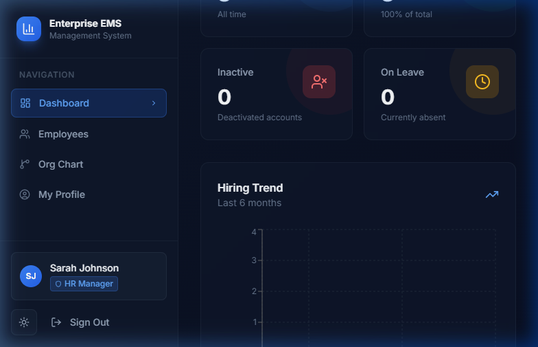
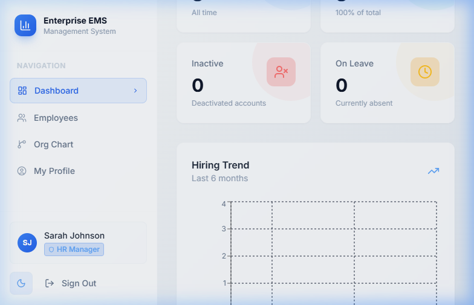
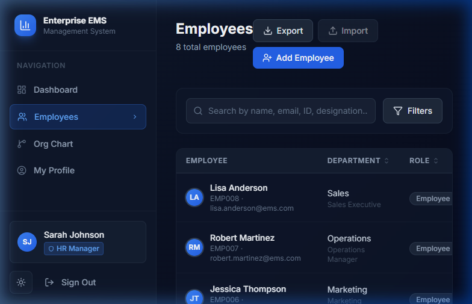
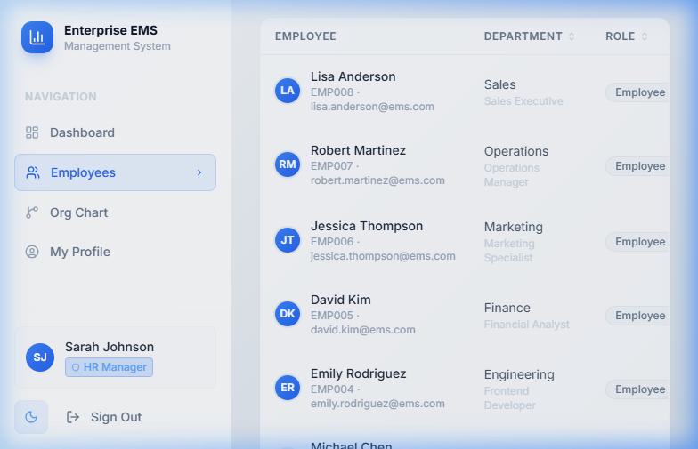

# Enterprise Employee Management System (EMS)

A full-stack enterprise-grade Employee Management System built with **React + TypeScript**, **Node.js + Express**, **MongoDB**, and **Prisma ORM**, featuring secure JWT authentication, role-based access control, and an interactive organizational hierarchy.

---

## 📸 Screenshots & Demo Walkthrough

### 🎬 Animated Demo Recording (End-to-End)


### Dark Mode Dashboard


### Light Mode Dashboard


### Employees Directory with CSV Actions (Import & Export)


### Employees Directory (Light Mode)


---

## 🚀 Features

| Feature | Details |
|---|---|
| **Authentication** | JWT (access 15m + refresh 7d) with httpOnly cookies, bcrypt password hashing, token rotation |
| **RBAC** | 3 roles: Super Admin, HR Manager, Employee — enforced on all API endpoints |
| **Employee CRUD** | Full field set, profile image upload, soft delete |
| **Org Hierarchy** | Visual tree chart, cycle detection, direct reports |
| **Dashboard** | Stats, departments count, charts (hiring trend, role distribution, department breakdown) |
| **Search & Filter** | Full-text search, filter by department/role/status, multi-column sort |
| **Pagination** | All list endpoints paginated |
| **CSV Import & Export**| Bonus feature! Bulk-import employees from CSV (with validation) and export current rosters |
| **Departments** | CRUD with employee count |
| **Audit Log** | Tracks all CREATE/UPDATE/DELETE/IMPORT operations |
| **Docker** | `docker-compose.yml` for full stack |

---

## 🛠️ Tech Stack

| Layer | Technology |
|---|---|
| Frontend | React 19, TypeScript, Vite, Tailwind CSS |
| State | TanStack Query v5, React Context |
| Forms | React Hook Form + Zod |
| Charts | Recharts |
| Backend | Node.js, Express.js, TypeScript |
| ORM | Prisma |
| Database | MongoDB Atlas / Local MongoDB |
| Auth | JWT, bcryptjs |
| Testing | Jest, Supertest, ts-jest |

---

## 📋 Prerequisites

- Node.js 18+
- MongoDB instance (Atlas cluster or local database)
- npm 9+

---

## ⚡ Quick Start (Development)

### 1. Clone and Navigate
```bash
cd d:\EMS
```

### 2. Set up the Database

Update the database connection string in `backend/.env`:
```env
DATABASE_URL="mongodb+srv://<username>:<password>@<cluster>.mongodb.net/ems_db?appName=IssueFlowCluster"
```

### 3. Backend Setup
```bash
cd backend
# Install dependencies
npm install

# Generate Prisma client for MongoDB
npx prisma generate

# Sync schema and indexes with MongoDB
npx prisma db push

# Seed database with default admin and employees
npm run db:seed

# Start dev server (hot reload)
npm run dev
```
Backend runs at: **http://localhost:5000**

### 4. Frontend Setup
```bash
cd ../frontend
npm install
npm run dev
```
Frontend runs at: **http://localhost:5173**

---

## 🐳 Docker (Full Stack)

To run the entire app using Docker:
```bash
cd d:\EMS
docker-compose up -d
```

- Frontend: http://localhost
- Backend API: http://localhost:5000/api

Generate client and seed the MongoDB database inside Docker:
```bash
docker exec ems-backend sh -c "cd /app && npx prisma generate && npx prisma db push && npx ts-node prisma/seed.ts"
```

---

## 🔐 Default Credentials

After seeding:

| Role | Email | Password |
|---|---|---|
| Super Admin | admin@ems.com | Admin@123 |
| HR Manager | sarah.johnson@ems.com | Hr@123456 |
| Employee | michael.chen@ems.com | Employee@123 |

---

## 📂 Project Structure

```
d:\EMS\
├── backend/
│   ├── src/
│   │   ├── config/          # DB client, app config
│   │   ├── controllers/     # Auth, Employee, Org, Dashboard, Department
│   │   ├── middleware/      # JWT auth, RBAC, Zod validation, error handler
│   │   ├── routes/          # Express routers
│   │   └── server.ts        # Entry point
│   ├── prisma/
│   │   ├── schema.prisma    # MongoDB schema config
│   │   └── seed.ts          # Seed script
│   ├── tests/               # Jest + Supertest
│   └── Dockerfile
├── frontend/
│   ├── src/
│   │   ├── api/             # Axios instance + service modules
│   │   ├── components/      # Layout, Sidebar, UI primitives
│   │   ├── context/         # AuthContext
│   │   ├── pages/           # All page components
│   │   ├── routes/          # ProtectedRoute
│   │   └── types/           # TypeScript interfaces
│   └── Dockerfile
└── docker-compose.yml
```

---

## 🌐 API Reference

### Authentication
| Method | Endpoint | Access | Description |
|---|---|---|---|
| POST | `/api/auth/login` | Public | Authenticates user, returns access token + sets refresh token cookie |
| POST | `/api/auth/refresh` | Public | Rotates expired access tokens using the refresh cookie |
| POST | `/api/auth/logout` | Authenticated | Clears cookies and revokes tokens |
| GET | `/api/auth/me` | Authenticated | Returns current user details |

### Employees
| Method | Endpoint | Access | Description |
|---|---|---|---|
| GET | `/api/employees` | Admin, HR | Get paginated list of employees with search, filter, and sort |
| POST | `/api/employees` | Admin, HR | Create a new employee |
| POST | `/api/employees/import` | Admin, HR | Bulk import employees from CSV file |
| GET | `/api/employees/export` | Admin, HR | Export active employee database as a CSV download |
| GET | `/api/employees/:id` | Owner or Admin/HR | Get details of a single employee |
| PUT | `/api/employees/:id` | RBAC/Owner | Update employee profile fields |
| PATCH | `/api/employees/:id/manager` | Admin, HR | Update reporting manager with circular cycle checks |
| DELETE | `/api/employees/:id` | Super Admin | Soft-deletes employee from directory |
| GET | `/api/employees/:id/reportees` | Admin, HR | Get direct reports of a manager |
| POST | `/api/employees/:id/upload-image` | Owner or Admin/HR | Upload and update employee profile avatar |

### Organization
| Method | Endpoint | Access | Description |
|---|---|---|---|
| GET | `/api/organization/tree` | Authenticated | Get the complete reporting hierarchy tree |
| GET | `/api/organization/tree/:id` | Authenticated | Get reporting hierarchy sub-tree from a specific root ID |

### Dashboard
| Method | Endpoint | Access | Description |
|---|---|---|---|
| GET | `/api/dashboard/stats` | Admin, HR | Returns summary stats, role/dept counts, and hiring trends |

---

## 🔒 RBAC Summary

| Action | Super Admin | HR Manager | Employee |
|---|---|---|---|
| View all employees | ✅ | ✅ | ❌ |
| Create employee | ✅ | ✅ | ❌ |
| Edit any employee | ✅ | ✅ (not role/salary) | ❌ |
| Delete employee | ✅ | ❌ | ❌ |
| Assign Super Admin | ✅ | ❌ | ❌ |
| View/Edit own profile | ✅ | ✅ | ✅ (limited to phone/avatar) |
| View dashboard | ✅ | ✅ | ❌ |
| Manage departments | ✅ | ❌ | ❌ |

---

## 🧪 Running Tests

```bash
cd backend
npm test              # Run all tests
npm run test:watch    # Watch mode
npm run test:coverage # Coverage report
```

---

## 🏗️ Production Build

```bash
# Backend
cd backend && npm run build && npm start

# Frontend
cd frontend && npm run build
# Serve dist/ with nginx or any static host
```

---

## 🏆 Evaluation Criteria Checklist

Here is a summary of how this implementation meets the project's evaluation criteria:

### 1. Frontend UI & UX (20%) — **Status: Completed**
- **Theme Support**: Implemented premium Light and Dark themes with HSL color systems, CSS variables, and animated transitions.
- **Responsive Layout**: Designed a collapsible glassmorphic sidebar and fluid layouts adapting from mobile screens up to wide desktops.
- **Data Visualizations**: Integrated Recharts Area and Pie charts to provide visually engaging workforce summaries on the dashboard.
- **Interactive Elements**: Micro-animations on hover, toast notifications for API statuses, and loading state skeletons.

### 2. Backend APIs (20%) — **Status: Completed**
- **Token Rotation**: Implemented secure JWT-based access tokens (15m expiration) alongside HttpOnly refresh tokens (7d rotation) for authentication.
- **RESTful Endpoints**: Built comprehensive endpoints for auth, employees, departments, and organization hierarchy.
- **Unified Error Handling**: Integrated Express error-handling middleware that catches `AppError` instances and safely processes uncaught exceptions.

### 3. RBAC (15%) — **Status: Completed**
- **Middleware Control**: Created modular `authorize(...)` and `authorizeOwnerOrRole(...)` middlewares to gate endpoints by role.
- **Field-level Security**: Employees can only update their own phone and profile image, whereas HR Managers cannot assign `SUPER_ADMIN` roles or execute deletions.

### 4. Organizational Hierarchy (15%) — **Status: Completed**
- **Direct Reports**: Mapped managers via `managerId` and resolved direct reporting relationships recursively on the backend.
- **Cycle Prevention**: Embedded loop-detection checks (`checkCircularReference`) in both backend update routes and CSV imports to prevent circular reporting structure violations.
- **Hierarchy Visuals**: Created a dynamic organizational chart displaying report lines from the root node down.

### 5. CRUD (15%) — **Status: Completed**
- **Complete Schema**: Full CRUD supporting employee IDs, personal/professional details, roles, statuses, and manager IDs.
- **Bulk Imports & Exports**: Integrated file streams using `csv-parser` to bulk-import rosters, and configured custom CSV serialization downloads.
- **Soft Deletion**: Configured soft deletion (`isDeleted = true`) to maintain integrity in audit logs.

### 6. Database (5%) — **Status: Completed**
- **Prisma & MongoDB**: Migrated database engines to MongoDB Atlas using Prisma. Mapped unique indexes and object identifier types.
- **Data Consistency**: Utilized transaction APIs (`prisma.$transaction`) to keep user login profiles in sync with main employee records.

### 7. Validation (5%) — **Status: Completed**
- **API Guarding**: Used Zod schemas to validate requests (query, param, and body payloads) before hitting controllers.
- **Form-Level Safety**: Implemented React Hook Form paired with Zod validation schemas on the frontend to provide immediate field-level feedback.

### 8. Code Quality & Docs (5%) — **Status: Completed**
- **TypeScript**: Enforced strict type-checking on both frontend and backend configurations.
- **Robust Documentation**: Detailed dependencies, seeding procedures, environment configurations, and default roles/credentials.
